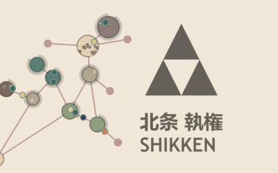

# Shikken 13k
***Zen-like, minimalist, RTS city-builder resource management game made for The 2023 13k games competition***

- Competition: https://js13kgames.com/entries/2023
- Theme: 13th Century
- Time frame: 1 month (but only spent a few weeks on it)
- Final zip size: 11.1 KB = 11,451 bytes

## Play

* Latest `main` branch: https://deathraygames.github.io/shikken-13k/

## Introduction

## History

[Shikken](https://en.wikipedia.org/wiki/Shikken) was the title of the supreme leader of Japan during the 13th century. When the Mongols demanded that Japan bend the knee, the shikken of the ruling [Hōjō clan](https://en.wikipedia.org/wiki/H%C5%8Dj%C5%8D_clan) commanded the forces that prepared for [the invasion](https://en.wikipedia.org/wiki/Mongol_invasions_of_Japan), and were ultimately successful in keeping Japan free.

## How to play

Take control of the shikken's defenders in this minimalist-styled, Zen-like, city-builder resource management game. Expand your network of buildings, upgrade them to produce resources, and manage the growing workforce. Pillaging Mongol invasions will be ever present until two [divine winds ("kamikaze")](https://en.wikipedia.org/wiki/Kamikaze_(typhoon)) come to the rescue.

Tap or click and drag to move the background map around. Tap a crossroad node or building, tap "Upgrade", select an upgrade that you can afford. Tap "Jobs" and reassign your people represented by moving circles of different colors. Many buildings will take some resources as an input, and after workers work there for some time, they will output something else. You'll need carriers to transport goods from place to place, and you'll need to turn buildings on and off to prioritize certain production. To unlock "Kamikaze" build rice farms and shrines.

## Credits

- This game is heavily inspired by Yiotro's [Achikaps](https://play.google.com/store/apps/details?id=yio.tro.achikaps_pro&hl=en_US&gl=US&pli=1), one of my favorite mobile games.
- Two color palettes were widely used: [Japanese Woodblock by Polyducks](https://lospec.com/palette-list/japanese-woodblock) and [Fading 16 by CopheeMoth](https://lospec.com/palette-list/fading-16).
- The `Vector2` class from KilledByAPixel's [LittleJS](https://github.com/KilledByAPixel/LittleJS) was used.
- All other programming, styling, and design was original, by Luke.
